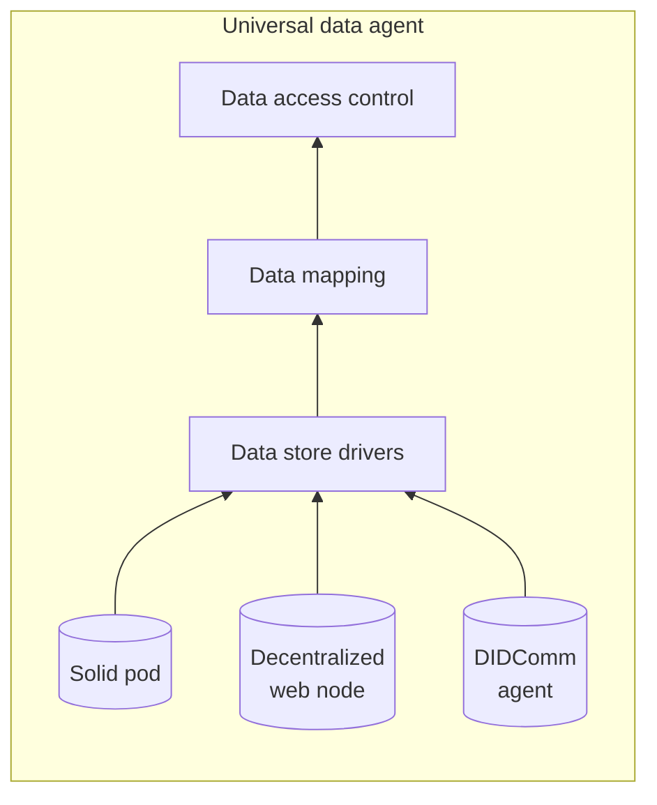

# High-level design (WIP)

## Problem context
This design addresses the simple scenario where agents want to be provided with data from other the personal stores of other agents. For example, where a service agent wants to be provided with personal data from a user agent. To rephrase this example in the terms used by this design: the service agent is the "service provider", the user agent is the "universal data agent", and the user's personal data is kept in "personal data stores".

This design provides a modular architecture for how the service provider can access personal data via universal data agents. This design allows the service provider to be decoupled from users' personal data by forcing data transfer to be mediated by the universal data agent. Thereby, the party in control of the universal data agent has definitive control over what data the service provider can access, and the universal data agent can pull from as few or as many personal data stores as desired to accommodate service providers, even if those personal data stores wouldn't otherwise have the necessary access control rules to do so on their own.

## Terminology
- **Service Provider:** An Agent that provides a service and communicates with *universal data agents* to access personal data.
- **Universal Data Agent:** An Agent that an individual client user has control of, which mediates data sharing between *personal data stores* and *service providers*, providing the user with self-sovereign access control over their data.
- **Personal Data Store:** A source/store of personal data that is accessible to the *universal data agent* via *data store drivers*. Note that the *universal data agent* does not assume that it has exclusive access to *personal data stores*, as they may be read and modified outside of this system.
- **Verifiable Credential (VC):** (See [W3C Verifiable Credentials Definition](https://www.w3.org/TR/vc-data-model/)).
- **Decentralized Identifier (DID):** (See [W3C DIDs Definition](https://www.w3.org/TR/did-core/)).

## Requirements

## Scope

## Architecture

## Use cases

### NSF Healthcare
This architecture supports the use case where a researcher party maintains service providers to collect health data from many people, where each person is considered an "end user", and is represented by a respective universal data agent. Users have their health data stored inside of what is called a "Personal Data Account" (PDA), which is a remote store for JSON data provided by the company "Dataswift". Users' PDAs are assumed to be populated with health data outside of this architecture. The end user can control their universal data agents via a mobile app, in which they have the option to transfer data from their personal PDA to service providers.

In a typical example case of data transfer, the user is assumed to have a QR code from a service provider that they want to send to. How the user obtains this QR code is outside of this architecture. The user is also assumed to have set data access rules for what specific data they want to send to the service provider. Once the user scans the QR code in the mobile app, the app makes a request to the universal data agent, saying that they want to transfer specific data to the service provider specified by the QR code's. Once the data agent receives this request, it parses the QR code as contact information for where it can communicate with the service provider. With this information, the data agent sends an Out-of-Band message to the service provider... ***TODO*** The data agent then pulls the personal data as previously specified, and sends it to the service provider via ***TODO protocol***. At this point, the transfer is completed, and the end user is notified of the successful transfer in their app.

Docs for this use case implementation can be seen here: [TODO]().

## Delivery plan
