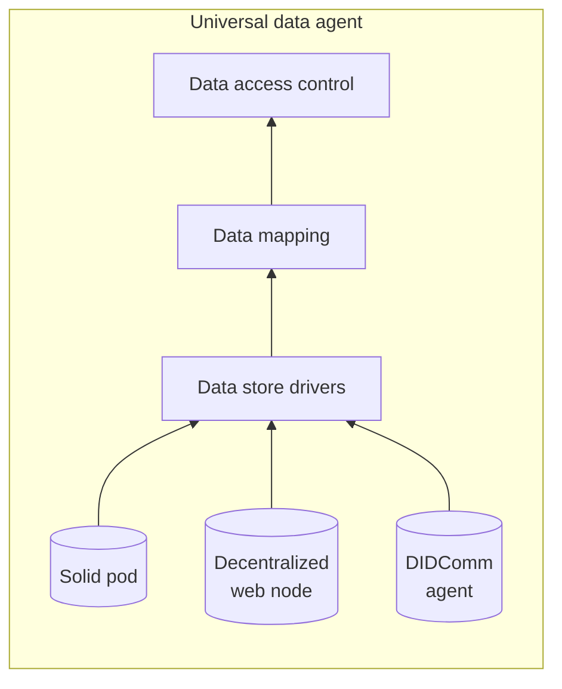

# High-level design (WIP)

## Problem context
Many research projects depend directly on the quality and availability of data collected from participants. Unfortunately, great complexity comes with this process of data collection due to the privacy concerns with assimilating data from the various different isolated sources that researchers may want to tap into. For example, researchers may want participants to share data from a wide range of sources such as health records, smartphones, or wearable technology. Participants however might lack the ability to control precisely which data from these sources gets shared at what times, and to which parties that data gets consumed by. Traditional centralized solutions may be not preferable, as they can be vulnerable to a single-point-of-failure, and may ultimately aggregate either too little or too much data to match both the needs of the researchers and the privacy concerns of the participants. This design aims solve this technical challenge by providing participants, or "data donors", with a simple privacy-preserving way to control and monitor their data for sharing with a potential variety of different researcher targets.

## Terminology
- **Service Provider:** An Agent that provides a service and communicates with *universal data agents* to access personal data.
- **Universal Data Agent (UDA):** An Agent that an individual client user has control of, which mediates data sharing between *personal data stores* and *service providers*, providing the user with self-sovereign access control over their data.
- **Personal Data Store:** A source/store of personal data that is accessible to the *universal data agent* via *data store drivers*. Note that the *universal data agent* does not assume that it has exclusive access to *personal data stores*, as they may be read and modified outside of this system.
- **Verifiable Credential (VC):** (See [W3C Verifiable Credentials Definition](https://www.w3.org/TR/vc-data-model/)).
- **Decentralized Identifier (DID):** (See [W3C DIDs Definition](https://www.w3.org/TR/did-core/)).

## Requirements
What this solution should achieve is a privacy-preserving way for people (users) to share their personal data with services (service providers) within the decentralized ecosystem. Users, or "data donors", must be guaranteed control over the data in their "personal clouds". Specifically, users should be able to control and monitor what specific data is shared from their personal clouds. Furthermore, they should have control over which specific target services will have access to their data, and must be able to first review and consent to the respective Terms of Service before data sharing occurs. 

## Scope
This design fills the gap in connecting existing user data sources with researchers by utilizing DIDComm agents, DIDs, and VCs. We assume that users already have VCs to authenticate themseleves for services, and that services have methods with which they can use these VCs to prove that users are authentic and valid for their use case of data collection. We also assume that users have personal data stores, or sources, that are accessible to users' universal data agents and are available at any time. Furthermore, hosting of any component of this design is out of scope, such as for service providers or universal data agents. DIDComm agents should be already implemented, and only lightly modified if necessary. What is mainly in scope is the implementation of the universal data agent, along with the communicating service provider agent, which are both "controllers" of their underlying DIDComm agents.

## Proposed Solution
This design addresses the simple abstract scenario where agents want to be provided with data from the personal stores of other agents. For example, where a service agent wants to be provided with personal data from a user agent. To rephrase this example in the terms used by this design: the service agent is the "service provider", the user agent is the "universal data agent", and the user's personal data is kept in "personal data stores".

The universal data agent (UDA) acts as a personal cloud for an individual user that controls it, which is capable of both pulling data from the user's personal data stores and also providing that data to service providers at the user's direction. The UDA is essentially the focal point of this design, as it bridges the gap between personal data sources and consuming services, while giving the user full access control over what gets shared and how. In order to share data with service providers within the decentralized identity ecosystem, the UDA is implemented as a controller of an underlying DIDComm agent so that it can communicate with DIDComm agents of service providers. To pull data from existing personal data stores however, the UDA may access data from a variety of sources by using "data store drivers". We intend each data store driver to be responsible for reading from a specific personal data store that it integrates, allowing that data to be pulled and exposed to the UDA as needed. After raw data is initially pulled from data store drivers, a data mapping layer will be used to further transform data if necesdsary before it is shared. Finally, the data access control layer will be used to ultimately decide what gets sent to service providers at the direction of the controlling user by precisely enforcing what, when, and where data is shared.

This design provides a modular architecture for how the service provider can access personal data via universal data agents. This design allows the service provider to be decoupled from users' personal data by forcing data transfer to be mediated by the universal data agent. Thereby, the party in control of the universal data agent has definitive control over what data the service provider can access, and the universal data agent can pull from as few or as many personal data stores as desired to accommodate service providers, even if those personal data stores wouldn't otherwise have the necessary access control rules to do so on their own.

In an example case of data transfer: a user may want to share their data with a service provider by using a mobile app on their smartphone. In this example, the user is assumed to have a QR code from the service provider that they want to send to. How the user obtains this QR code, or any invitation for communication from a service provider, is outside of the scope of this design. The user uses the app to control their universal data agent, in which they give it access to their personal data stores and define exactly what data they want to send to the service provider. Once the user scans the QR code in the mobile app, the app makes a request to the UDA, saying that they want to transfer their data to the service provider that provided the QR code. Once the data agent receives this request, it parses the QR code as contact information for where it can communicate with the service provider. With this information, the UDA uses the DIDComm Out-of-band protocol to send an initial message to the service provider, stating that the user has accepted the invitation to begin a connection. Following this, the UDA uses the DID Exchange protocol to inform the service provider of how to respond back to the UDA, thereby making the connection active after the service provider acknowledges and completes the exchange. Verifiable credentials may be sent from the UDA to the service provider via the Present Proof protocol in order to authenticate the user. Finally, the user and service provider now have a trusted way to communicate with eachother. The UDA can then send data as previously specified to the service provider over DIDComm.

### Architecture

## Use cases

### NSF Healthcare
This architecture supports the use case where a researcher party maintains service providers to collect health data from many people, where each person is considered an "end user", and is represented by a respective universal data agent. Users have their health data stored inside of what is called a "Personal Data Account" (PDA), which is a remote store for JSON data provided by the company "Dataswift". Since PDA is a personal data store, it is assumed to be populated with health data outside of the scope of this design. The end user can control their universal data agents via a mobile app, in which they have the option to transfer data from their personal PDA to service providers.

Docs for this use case implementation can be seen here: [TODO]().

## Delivery plan
TODO
